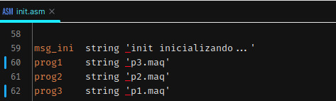

# Análise Trabalho 2 - Processos

Foram feitas simulações variando valor de quantum, 4 e 10, e o algoritmo do 
escalonado FIFO e algoritmo de prioridade.
--- 
Os registros estão nos arquivos:  
- relatorio_F_4.txt: Algoritmo FIFO com quantum 4
- relatorio_P_4.txt: Algoritmo de Prioridade com quantum 4. 
- relatorio_F_10.txt: Algoritmo FIFO com quantum 10
- relatorio_P_10.txt: Algoritmo de Prioridade com quantum 10.
- relatorio_F_4.txt: Algoritmo de Prioridade com quantum 4, e p1.asm e p3.
  asm com ordens de execução trocadas.
- relatorio_P_4_TR.txt: Algoritmo de Prioridade com quantum 4, e p1.asm e p3.
  asm com ordens de execução trocadas.

---
Compreende-se a diferença entre programa e processo, entretanto para 
facilitar a escrita e leitura deste texto, será usado o nome dos programas 
para referir-se aos processos.
- p1.asm: Bastante CPU, pouca E/S (PID 2)
- p2.asm: Média CPU, média E/S (PID 3)
- p3.asm: Bastante CPU, bastante E/S (PID 4)

---
## Algoritmo FIFO:
Analisando tanto o relatório gerado pela CPU, quanto rodando o programa em 
si, percebe-se que o algoritmo tem um comportamento relativamente simples de 
prever, coincidindo com a simplicidade do algoritmo. Os três algoritmos que 
executam concorrentemente (não paralelamente) têm uma evolução linear.  
Aos 
olhos do usuário, no momento inicial onde os programas escrevem suas 
características (ex.: "bastante CPU pouca E/S"") os programas executam "ao 
mesmo tempo". No momento seguinte este comportamento muda e varia conforme o 
valor definido para o quantum.

### Quanto ao Quantum:
Ao variar o valor de quantum observa-se um comportamento diferente em cada 
execução.  
Para um valor de 4 quantuns, ocorrem mais preempções e obtêm-se um 
tempo de execução total menor, em relação a 10 quantuns. Também é 
interessante notar nesta configuração, que o tempo médio de execução entre 
os processos está melhor distribuído e a ordem em que os processos terminam 
é p2.asm, p1.asm e p3.asm.  
Para 10 quantuns, há um número menor de preempções. Enquanto para 4 
quantuns houveram 49 preempções distribuídas entre p1.asm e p2.asm, nesta 
configuração houveram 14 preempções, somente em p1.asm. Assim, alterando a 
ordem em que os programas foram finalizados, para o número de quantuns maior 
a ordem foi p1.asm, p2.asm e p3.asm.  
A variação do valor de quantum também é perceptível ao usuário, para 4 Q
(quantuns) a tela ficou parada poucas vezes, quando p1.asm executava.
Já para 10 Q, mais vezes o sistema parecia estar "parado", sendo isto 
referente ao maior tempo que p1.asm tinha para executar, obviamente o 
processo p1.asm pode evoluir mais rapidamente.

## Algoritmo de Prioridade 
No algoritmo de Prioridade escolhe-se o processo com mais prioridade, a 
prioridade é calculada como `prio = (prio + t_exec/t_quantum)`, sendo 
atualizada cada vez que um processo é bloqueado ou preemptado. Observando 
isto, percebe-se que processos que consomem mais cpu terão maior prioridade 
em cada atualização.  
Apesar da ideia deste algoritmo parecer razoavelmente boa, ela possui um 
resultado pior que o algoritmo de FIFO. Isto se deve ao fato de que a CPU 
pode ser facilmente "monopolizada" por unicamente dois processos. Caso dois 
processos obtenham um valor de prioridade maior que os demais, o escalonador 
ficará revezando entre estes dois, não dando chance para os demais 
processos evoluírem(e aumentar sua prioridade) até que algum destes 
processos morra ou bloqueie por tempo suficiente para que as prioridades 
tornem-se mais próximas.  
Isto foi observado na execução da simulação, onde o processo p3.asm executa 
tardiamente e evoluí muito lentamente. Como p1.asm e p2.asm usam mais CPU e 
iniciam primeiro 
eles adquirem maior prioridade e revezam a CPU entre si.  
Vendo isto, cogitou-se que se p3.asm executasse primeiro o desempenho seria 
melhor, pois, p3.asm teria uma vantagem inicial e mesmo que ao longo da 
execução p2.asm e p1.asm "roubassem" a CPU o valor de prioridade 
permaneceria mais próximo na média da execução. Foi feito o teste para isto:  
  
Como esperado, está mudança trouxe um desempenho melhor(Tempo de execução: 
19261), mas além do esperado o desempenho foi melhor que as demais 
configurações testadas.
